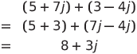
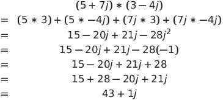
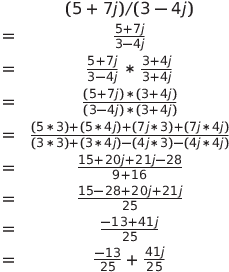

# homework 3
Homework 3 of ECE231. Due 10/15/2022 at midnight.

## Context
For this assignment, you are going to do a classic problem. Create a class for representing complex numbers. You are given the files `complex.hpp` which declares some methods and operator overloads for the `Complex` class. You are also given `main.cpp`, which will test the `Complex` class. **You'll have to create a cpp file that will contain your constructors, methods, and operator overloads. As well as add missing declarations in `complex.hpp`.**

## complex.hpp
In `complex.hpp`, the class has these attributes (data members):

    double _real
    double _imag

You can edit `_real` and `_imag` to be whatever you want, as long as you have two double variables to represent the real and imaginary parts of a complex number. The header file also has these prototypes:
    
    Default constructor (no arguments)
    Default constructor (with arguments)
    Copy constructor
    A setter method to set the imaginary number
    A getter method to get the real number
    A method to print the polar form of a complex number
    A method to add two complex numbers
    A method to multiply two complex numbers
    A method to get (and calculate) the complex conjugate
    A method to get (and calculate) the magnitude of a complex number

and these operator overloading declarations:

    +
    =
    <<

Feel free to edit the inputs, just make sure that you are being consistent with your header file declarations and method implementations.

Additionally, the header file is missing:
  
    A setter method to set the value of the real number
    A getter method to get the value of the imaginary number
    A method to print the attributes
    A method to subtract two complex numbers
    A method to divide two complex numbers
    A method to get (and calculate) the phase (or angle) of a complex number

It is also missing these operator overloading declarations:

    *
    -
    /

Your job is to fill in what is missing in the hpp file. And in your cpp file, you must implement all prototypes defined above. The cpp file must also include the `math.h` library (to include it, type `#include <cmath>`) as you will need the function `atan` for the `phase` method. For the method to print the attributes, as well as the << operator, it must have this format: `a + bj` or `a - bj`. Additionally, the format for printing the complex number in polar form is: `m, p`, where `m` is the magnitude, and `p` is the phase. You will create a Makefile that compiles and runs your code smoothly.

To see an example of creating a class with multiple files, please see [this](https://github.com/Fviramontes8/UNMECE231Code/tree/main/Classes/IntList).

## More on multiplying and dividing complex number

For adding and subtracting two complex numbers, you simply need to pair the real parts and the imaginary parts. For example:

However, if we multiply the same number, it will look like this:

Now, dividing a complex number can be complex (hahaha). It usually starts by multiplying the quotient by the conjugate of the denominator but as a 1 because we cannot have complex numbers in the denominator section of a quotient. So if using the same numbers as the two previous examples, we must multiply by (3 + 4j) / (3 + 4j) which equals 1, but makes the denominator only contain real numbers.

## Rubric

|Requirement                                         |Score  |
|  :---:                                             | :---: |
|Completing the header file and prototypes           | 20%   |
|Creation of cpp files and implementation of methods | 30%   |
|Correct implementation of overloading operators     | 20%   |
|Creation of Makefile                                | 20%   |
|Clean and readable code                             | 10%   |
|Total                                               | 100%  |
